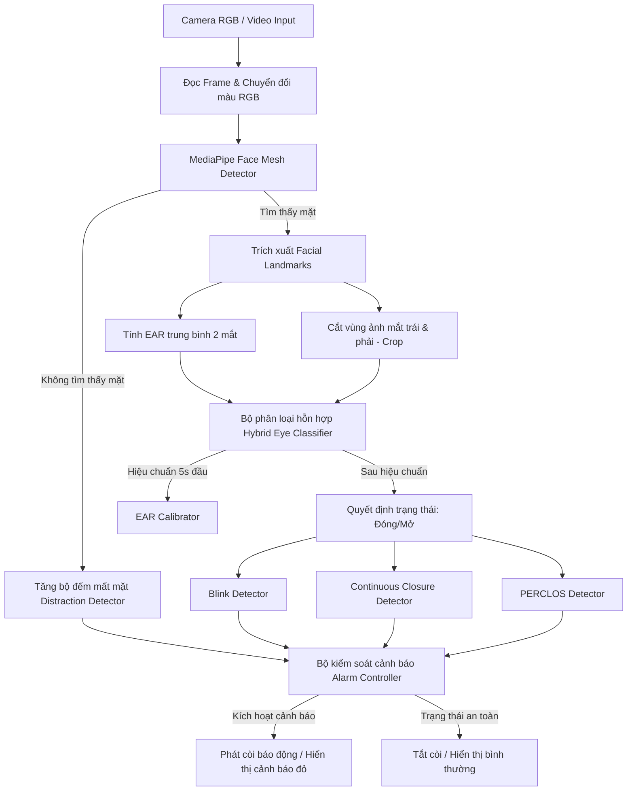
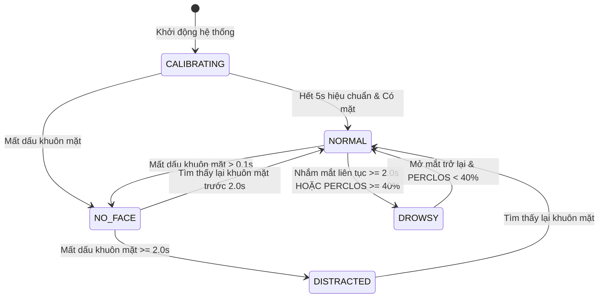

# BÁO CÁO ĐỒ ÁN TỐT NGHIỆP / ĐỒ ÁN MÔN HỌC

## ĐỀ TÀI: HỆ THỐNG CẢNH BÁO BUỒN NGỦ VÀ MẤT TẬP TRUNG CHO TÀI XẾ BẰNG THEO DÕI MẮT THỜI GIAN THỰC (DRIVER DROWSINESS AND DISTRACTION WARNING SYSTEM)

---

> [!NOTE]
> **Hướng dẫn sử dụng tài liệu:**
> Tài liệu này được biên soạn dưới dạng khung (template) chuẩn cho một báo cáo đồ án thuộc khối ngành Công nghệ thông tin / Điện tử viễn thông. Các phần được đánh dấu bằng các khối blockquote như thế này chứa hướng dẫn chi tiết về nội dung bạn cần viết, sơ đồ cần vẽ hoặc kết quả cần điền. Các liên kết đến mã nguồn thực tế của dự án cũng được nhúng sẵn để thuận tiện cho việc tham chiếu khi làm báo cáo.

---

## MỤC LỤC CHÍNH

- [PHẦN MỞ ĐẦU](#phần-mở-đầu)
- [CHƯƠNG 1: CƠ SỞ LÝ THUYẾT VÀ CÁC CÔNG NGHỆ LIÊN QUAN](#chương-1-cơ-sở-lý-thuyết-và-các-công-nghệ-liên-quan)
- [CHƯƠNG 2: PHÂN TÍCH VÀ THIẾT KẾ HỆ THỐNG]
  (#chương-2-phân-tích-và-thiết- kế-hệ-thống)
- [CHƯƠNG 3: HIỆN THỰC HỆ THỐNG VÀ CÀI ĐẶT CHI TIẾT](#chương-3-hiện-thực-hệ-thống-và-cài-đặt-chi-tiết)
- [CHƯƠNG 4: THỰC NGHIỆM, KIỂM THỬ VÀ ĐÁNH GIÁ ĐỘ CHÍNH XÁC](#chương-4-thực-nghiệm-kiểm-thử-và-đánh-giá-độ-chính-xác)
- [CHƯƠNG 5: KẾT LUẬN VÀ HƯỚNG PHÁT TRIỂN](#chương-5-kết-luận-và-hướng-phát-triển)
- [TÀI LIỆU THAM KHẢO](#tài-liệu-tham-khảo)
- [PHỤ LỤC](#phụ-lục)

---

## PHẦN MỞ ĐẦU

> [!TIP]
> **Nội dung cần trình bày:**
>
> - **Lý do chọn đề tài:** Trích dẫn các số liệu thống kê tai nạn giao thông đường bộ (ví dụ: số liệu của WHO hoặc Ủy ban An toàn Giao thông Quốc gia) liên quan đến ngủ gật và mất tập trung. Nhấn mạnh tính cấp thiết của một giải pháp cảnh báo sớm, phi xâm lấn (non-invasive), chi phí thấp, chạy được trên các thiết bị camera thông thường.
> - **Mục tiêu đề tài:** Thiết kế và xây dựng thành công ứng dụng giám sát tài xế qua camera thời gian thực, tự động phát hiện các hành vi buồn ngủ (nhắm mắt kéo dài, PERCLOS cao) và mất tập trung (ngoảnh mặt đi nơi khác, mất dấu khuôn mặt) để đưa ra cảnh báo kịp thời.
> - **Phạm vi nghiên cứu:** Giới hạn trong môi trường buồng lái xe, sử dụng camera RGB thông thường để ghi hình trực diện tài xế. Không bao gồm các thiết bị cảm biến đeo trên người.
> - **Phương pháp nghiên cứu:** Nghiên cứu lý thuyết về Facial Landmarks (MediaPipe); xây dựng chỉ số EAR kết hợp mô hình học sâu CNN để xác định trạng thái đóng/mở mắt; tính toán PERCLOS; lập trình ứng dụng bằng ngôn ngữ Python.

---

## CHƯƠNG 1: CƠ SỞ LÝ THUYẾT VÀ CÁC CÔNG NGHỆ LIÊN QUAN

### 1.1. Bài toán phát hiện buồn ngủ và mất tập trung

- Phân tích hành vi sinh học của con người khi mệt mỏi: giảm tần suất chớp mắt, thời gian nhắm mắt kéo dài, đầu gục xuống.
- Phân tích hành vi mất tập trung: mắt không hướng về phía trước, đầu quay quá góc giới hạn (ngoảnh sang bên trái/phải, cúi xuống nhìn điện thoại).

### 1.2. Định vị khuôn mặt và Facial Landmarks bằng MediaPipe Face Mesh

- Giới thiệu giải pháp **MediaPipe Face Mesh**: mô hình sinh ra 468 (hoặc 478) điểm mốc (landmarks) 3D trên khuôn mặt thời gian thực.
- So sánh ưu nhược điểm với các thư viện cũ hơn như Dlib (68 landmarks) hoặc Haar Cascades:
  - MediaPipe hoạt động tốt dưới các góc nghiêng nhẹ và điều kiện ánh sáng thay đổi.
  - Tốc độ xử lý (FPS) vượt trội trên cả các thiết bị không có GPU mạnh (chỉ dùng CPU).

### 1.3. Chỉ số tỷ lệ mắt EAR (Eye Aspect Ratio)

Chỉ số EAR được sử dụng để định lượng độ mở của mắt dựa trên khoảng cách giữa các điểm mốc mi mắt trên, mi mắt dưới và hai khóe mắt.

Công thức toán học tính toán EAR cho một mắt:
$$EAR = \frac{||p_2 - p_6|| + ||p_3 - p_5||}{2 \cdot ||p_1 - p_4||}$$

Trong đó:

- $p_1, p_4$ là tọa độ hai khóe mắt (chiều ngang).
- $p_2, p_3, p_5, p_6$ là tọa độ các điểm đối xứng trên mi mắt trên và mi mắt dưới (chiều dọc).

> [!NOTE]
> Trong mã nguồn dự án tại [eye_metrics.py](file:///E:/Learnsmth/Python/LapTrinhUDDPT/src/eye_metrics.py), hàm [calculate_ear](file:///E:/Learnsmth/Python/LapTrinhUDDPT/src/eye_metrics.py#L10) thực hiện thuật toán này bằng cách tính khoảng cách Euclid giữa các điểm Landmark được trích xuất từ MediaPipe.
> Điểm mốc mắt trái và phải lần lượt được định nghĩa bằng các hằng số:
>
> - `LEFT_EYE_INDICES = [33, 160, 158, 133, 153, 144]`
> - `RIGHT_EYE_INDICES = [362, 385, 387, 263, 373, 380]`

### 1.4. Phân loại trạng thái đóng/mở mắt bằng Convolutional Neural Network (CNN)

- Mặc dù EAR rất hiệu quả, chỉ số này dễ bị nhiễu do hình dạng mắt mỗi người khác nhau hoặc khoảng cách từ mặt đến camera thay đổi. Do đó, hệ thống sử dụng thêm một mô hình **CNN bổ trợ**.
- **Kiến trúc mô hình:** Sử dụng mạng tích chập sâu (CNN) nhận đầu vào là ảnh vùng mắt cắt từ khung hình gốc với kích thước chuẩn hóa $(224 \times 224 \times 3)$ pixel.
- **Tập nhãn đầu ra:**
  - `Open` (Mắt mở)
  - `Closed` (Mắt đóng)
  - `Unknown` (Không rõ trạng thái)
- Mã nguồn tải và thực thi dự báo của mô hình nằm tại lớp [EyeClassifier](file:///E:/Learnsmth/Python/LapTrinhUDDPT/src/eye_classifier.py#L7) trong [eye_classifier.py](file:///E:/Learnsmth/Python/LapTrinhUDDPT/src/eye_classifier.py).

### 1.5. Chỉ số PERCLOS (Percentage of Eye Closure)

- **PERCLOS** là tỷ lệ thời gian mắt nhắm (thường được định nghĩa là mi mắt đóng hơn 70% hoặc 80%) trong một khoảng thời gian quan sát nhất định (ví dụ: cửa sổ trượt 60 giây).
- Công thức:
  $$PERCLOS = \frac{\sum T_{Closed}}{T_{Observation}}$$
- Chỉ số PERCLOS được coi là một trong những thước đo sinh học gián tiếp đáng tin cậy nhất để đánh giá trạng thái mệt mỏi tích lũy của lái xe.

---

## CHƯƠNG 2: PHÂN TÍCH VÀ THIẾT KẾ HỆ THỐNG

### 2.1. Yêu cầu chức năng và phi chức năng

- **Yêu cầu chức năng:**
  1. _Hiệu chuẩn tự động (Calibration):_ Tự động tính toán ngưỡng EAR nền của người dùng khi khởi động.
  2. _Giám sát thời gian thực:_ Đọc luồng video từ camera, phát hiện khuôn mặt và mắt.
  3. _Hợp nhất quyết định (Decision Fusion):_ Kết hợp EAR và CNN để tăng độ tin cậy khi xác định trạng thái đóng mắt.
  4. _Đếm số lần chớp mắt (Blink Detection):_ Tính toán tần số chớp mắt trên phút.
  5. _Cảnh báo buồn ngủ nhanh (Continuous Closure Warning):_ Báo động ngay khi tài xế nhắm mắt liên tục quá $t$ giây.
  6. _Cảnh báo mệt mỏi tích lũy (PERCLOS Warning):_ Báo động khi tỷ lệ nhắm mắt tích lũy vượt ngưỡng.
  7. _Cảnh báo mất tập trung (Distraction Warning):_ Báo động khi tài xế quay đi hoặc camera bị che khuất trong một khoảng thời gian.
- **Yêu cầu phi chức năng:**
  - Tốc độ xử lý tối thiểu đạt $20 - 30$ FPS trên máy tính cá nhân.
  - Độ trễ phát hiện cảnh báo dưới $0.5$ giây.

### 2.2. Kiến trúc tổng thể và Luồng dữ liệu (Dataflow)

Hệ thống nhận luồng ảnh đầu vào từ Camera, đi qua bộ phát hiện Landmark để trích xuất EAR và vùng ảnh mắt (crop). Tiếp theo, bộ quyết định kết hợp (Hybrid Classifier) phân loại trạng thái mắt trước khi gửi đến các module dò tìm trạng thái (detectors). Cuối cùng, tín hiệu kích hoạt cảnh báo được gửi đến Alarm Controller.

Sơ đồ luồng xử lý chi tiết của hệ thống:



### 2.3. Thiết kế các Module chức năng

Hệ thống được chia thành các lớp thành phần độc lập nhằm tối ưu hóa việc bảo trì và kiểm thử:

- **Module Cấu hình:** [config.py](file:///E:/Learnsmth/Python/LapTrinhUDDPT/src/config.py) chứa toàn bộ các ngưỡng thời gian, ngưỡng tỉ lệ và cài đặt cửa sổ lọc.
- **Module Xử lý chính:** [main.py](file:///E:/Learnsmth/Python/LapTrinhUDDPT/src/main.py) chịu trách nhiệm khởi chạy OpenCV, vòng lặp camera, khởi tạo MediaPipe và phối hợp hoạt động giữa các detector.
- **Các Detector đặc tả:**
  - [ear_calibration.py](file:///E:/Learnsmth/Python/LapTrinhUDDPT/src/detectors/ear_calibration.py): Hiệu chuẩn ngưỡng EAR tùy biến theo từng người.
  - [blink.py](file:///E:/Learnsmth/Python/LapTrinhUDDPT/src/detectors/blink.py): Lọc rung tín hiệu (debounce) để đếm số lần chớp mắt hợp lệ.
  - [eye_closure.py](file:///E:/Learnsmth/Python/LapTrinhUDDPT/src/detectors/eye_closure.py): Phát hiện nhắm mắt liên tục (buồn ngủ đột ngột).
  - [perclos.py](file:///E:/Learnsmth/Python/LapTrinhUDDPT/src/detectors/perclos.py): Quản lý cửa sổ trượt thời gian để tính toán PERCLOS.
  - [distraction.py](file:///E:/Learnsmth/Python/LapTrinhUDDPT/src/detectors/distraction.py): Giám sát sự xuất hiện của khuôn mặt trong khung hình.
- **Module cảnh báo:** [alarm_controller.py](file:///E:/Learnsmth/Python/LapTrinhUDDPT/src/alarm_controller.py) điều khiển luồng phát âm thanh cảnh báo bằng cách chạy thread phụ tránh block giao diện chính.

### 2.4. Thiết kế Máy trạng thái hệ thống (System State Machine)

Hệ thống hoạt động như một máy trạng thái hữu hạn để kiểm soát luồng hiển thị giao diện và âm thanh:



---

## CHƯƠNG 3: HIỆN THỰC HỆ THỐNG VÀ CÀI ĐẶT CHI TIẾT

### 3.1. Môi trường cài đặt và các thư viện cốt lõi

- **Ngôn ngữ:** Python (phiên bản `>= 3.8`).
- **Thư viện chính:**
  - `opencv-python` (`cv2`): Đọc camera, xử lý ảnh cơ bản, vẽ đồ họa hiển thị lên giao diện runtime.
  - `mediapipe`: Trích xuất 468 điểm mốc khuôn mặt cực kỳ nhanh.
  - `tensorflow` và `keras`: Load mô hình CNN dạng `.h5` và thực hiện lan truyền xuôi (`model.predict`) trên ảnh vùng mắt.
  - `numpy`: Xử lý mảng ảnh nhanh, chuẩn hóa ma trận dữ liệu.
  - `pygame` hoặc các thư viện phát âm thanh để phát còi cảnh báo.

### 3.2. Thuật toán hợp nhất quyết định (Decision Fusion Logic)

Để khắc phục điểm yếu của từng phương pháp riêng lẻ:

- Nếu chỉ dùng EAR: Dễ báo giả khi tài xế cúi nhẹ đầu làm giảm khoảng cách mắt trên camera.
- Nếu chỉ dùng CNN: Mô hình học sâu đôi khi có độ trễ hoặc bị ảnh hưởng bởi góc chụp xiên.
- **Quy tắc hợp nhất (Hybrid Decision):**
  - Bước 1: Tính toán giá trị EAR mượt thông qua bộ lọc thông thấp (EMA):
    $$EAR_{smoothed} = \alpha \cdot EAR_{current} + (1 - \alpha) \cdot EAR_{previous}$$
  - Bước 2: Cắt vùng ảnh mắt trái và phải, đưa qua mô hình CNN dự đoán nhãn (`Open`/`Closed`) kèm độ tin cậy ($C_{CNN}$).
  - Bước 3: Đưa ra quyết định nhắm mắt:
    - Nếu $EAR_{smoothed} < Ngưỡng\_EAR\_Hiệu\_Chuẩn$ **VÀ** nhãn CNN dự đoán là `Closed` với độ tin cậy $C_{CNN} \ge 0.88$, xác nhận mắt **ĐÓNG**.
    - Các trường hợp tranh chấp khác sẽ được xử lý qua trọng số ưu tiên để tránh báo động giả lúc nháy mắt bình thường.

### 3.3. Hiện thực các Detector

- **Bộ hiệu chuẩn EAR động:** Trong 5 giây đầu (`CALIBRATION_DURATION`), hệ thống lưu lại tất cả các giá trị EAR khi người dùng nhìn thẳng bình thường. Ngưỡng EAR động cuối cùng được tính bằng:
  $$Threshold_{dynamic} = \text{Average}(EAR_{history}) \times 0.60$$
  Được kẹp trong khoảng an toàn $[0.12, 0.28]$ để tránh lỗi dữ liệu cực đoan.
- **Bộ đếm chớp mắt:** Sử dụng cơ chế đệm debounce frames (`BLINK_DEBOUNCE_FRAMES = 2`) để lọc các dao động giả, đồng thời tính thời gian từ lúc mắt bắt đầu đóng đến lúc mở lại. Chỉ ghi nhận là một chớp mắt hợp lệ khi thời gian nằm trong khoảng $[0.04s, 0.80s]$.
- **Bộ tính PERCLOS cửa sổ trượt:** Sử dụng cấu trúc hàng đợi hai đầu (`deque`) lưu trữ các mẫu thời gian thực trong vòng 60 giây gần nhất (`PERCLOS_WINDOW`). Hàm liên tục loại bỏ các phần tử cũ và tính tỷ lệ thời gian mà trạng thái mắt được xác nhận là `Closed`.

### 3.4. Giao diện điều khiển và Runtime UI

Giao diện trực quan hiển thị trực tiếp thông số tại màn hình runtime:

- Trạng thái hệ thống (Calibration Progress, Normal, Drowsy, Distracted).
- Số lần chớp mắt hiện tại (Blink Count) và tốc độ chớp mắt (Blink Rate).
- Chỉ số PERCLOS thời gian thực hiển thị dưới dạng phần trăm (%).
- Phím tương tác nhanh:
  - Phím `C`: Hiệu chuẩn lại ngưỡng EAR động (Recalibrate).
  - Phím `E`: Bật / Tắt cửa sổ hiển thị phóng to vùng mắt cắt ra (Eye Preview Window).
  - Phím `+` / `-`: Điều chỉnh tỉ lệ phóng to (zoom scale) ảnh vùng mắt.
  - Phím `Q`: Thoát chương trình một cách an toàn.

---

## CHƯƠNG 4: THỰC NGHIỆM, KIỂM THỬ VÀ ĐÁNH GIÁ ĐỘ CHÍNH XÁC

### 4.1. Kế hoạch kiểm thử

Kế hoạch kiểm thử được xây dựng nhằm đánh giá cả tính đúng đắn của các module xử lý chính và khả năng vận hành của hệ thống trong điều kiện sử dụng thực tế với webcam. Quá trình kiểm thử được chia thành hai nhóm: kiểm thử module và kiểm thử theo kịch bản demo.

**Nhóm 1: Kiểm thử module**

Nhóm kiểm thử này tập trung vào các thành phần có logic xử lý rõ ràng, có thể đánh giá bằng dữ liệu đầu vào và đầu ra cụ thể. Mục tiêu là xác nhận từng module hoạt động đúng trước khi tích hợp vào luồng xử lý thời gian thực.

| Module kiểm thử | Mục tiêu kiểm thử | Dữ liệu/điều kiện kiểm thử | Kết quả mong đợi |
| :-------------- | :---------------- | :------------------------- | :--------------- |
| Tính EAR | Kiểm tra công thức tính Eye Aspect Ratio từ các điểm mốc mắt. | Tập tọa độ mắt mở và mắt nhắm được trích từ landmark hoặc dữ liệu giả lập. | EAR của mắt mở lớn hơn EAR của mắt nhắm; giá trị trả về ổn định và không lỗi khi đủ điểm landmark. |
| Hiệu chuẩn EAR | Kiểm tra khả năng tự lấy ngưỡng đóng/mở mắt theo từng người dùng. | Người dùng nhìn thẳng, mở mắt bình thường trong thời gian hiệu chuẩn. | Hệ thống tạo được ngưỡng EAR phù hợp, thấp hơn EAR trung bình khi mở mắt. |
| Blink detector | Kiểm tra phát hiện và đếm số lần chớp mắt. | Chuỗi trạng thái mở/đóng mắt ngắn, có thời lượng nằm trong khoảng chớp mắt hợp lệ. | Chỉ các lần đóng mắt hợp lệ mới được tính là chớp mắt; nhiễu ngắn bị bỏ qua nhờ debounce. |
| Phát hiện nhắm mắt lâu | Kiểm tra cảnh báo buồn ngủ tức thời. | Trạng thái mắt đóng liên tục vượt ngưỡng `DROWSY_CLOSED_DURATION`. | Hệ thống chuyển sang trạng thái `DROWSY` và kích hoạt cảnh báo. |
| Tính PERCLOS | Kiểm tra tỉ lệ thời gian mắt đóng trong cửa sổ trượt. | Chuỗi dữ liệu mở/đóng mắt theo thời gian trong `PERCLOS_WINDOW`. | PERCLOS tăng khi thời gian mắt đóng nhiều hơn và cảnh báo khi vượt `PERCLOS_THRESHOLD`. |
| Mất dấu khuôn mặt | Kiểm tra phát hiện mất tập trung khi không còn nhận diện được mặt. | Camera bị che hoặc người dùng quay khỏi vùng quan sát quá thời gian cho phép. | Hệ thống chuyển sang trạng thái `DISTRACTED` sau `FACE_LOSS_THRESHOLD`. |

**Nhóm 2: Kiểm thử theo kịch bản demo**

Nhóm kiểm thử này dùng để chứng minh hệ thống hoạt động trong luồng chạy hoàn chỉnh với webcam thật. Người thử nghiệm thực hiện các hành vi mô phỏng tình huống lái xe, hệ thống xử lý trực tiếp từng khung hình, hiển thị trạng thái lên giao diện và phát âm thanh cảnh báo khi cần.

Các tiêu chí đánh giá gồm:

- Hệ thống nhận diện được khuôn mặt và vùng mắt trong điều kiện camera thông thường.
- Trạng thái hiển thị trên giao diện khớp với hành vi thực tế của người thử nghiệm.
- Cảnh báo được kích hoạt đúng trong các trường hợp nhắm mắt lâu, PERCLOS cao hoặc mất dấu khuôn mặt.
- Hệ thống không phát cảnh báo sai khi người thử nghiệm mở mắt bình thường và chớp mắt tự nhiên.
- Thời gian phản hồi của cảnh báo nằm trong ngưỡng cấu hình, đặc biệt với các ngưỡng `DROWSY_CLOSED_DURATION` và `FACE_LOSS_THRESHOLD`.

### 4.2. Cấu hình tham số thực nghiệm

Hệ thống sử dụng tệp cấu hình tập trung [config.py](file:///E:/Learnsmth/Python/LapTrinhUDDPT/src/config.py) với các giá trị được tinh chỉnh qua thực nghiệm:

| Tham số                           | Giá trị mặc định | Giải thích ý nghĩa                                                          |
| :-------------------------------- | :--------------: | :-------------------------------------------------------------------------- |
| `DEFAULT_EAR_THRESHOLD`           |      `0.2`       | Ngưỡng EAR dự phòng trước khi hiệu chuẩn hoàn tất.                          |
| `DROWSY_CLOSED_DURATION`          |   `2.0` (giây)   | Thời gian nhắm mắt liên tục tối đa để kích hoạt báo động buồn ngủ tức thời. |
| `PERCLOS_WINDOW`                  |  `60.0` (giây)   | Độ dài cửa sổ thời gian trượt dùng để tính toán chỉ số PERCLOS.             |
| `PERCLOS_THRESHOLD`               |   `0.4` (40%)    | Ngưỡng PERCLOS kích hoạt báo động buồn ngủ tích lũy (mệt mỏi).              |
| `PERCLOS_MIN_OBSERVATION_TIME`    |  `10.0` (giây)   | Thời gian tối thiểu quan sát hệ thống trước khi bắt đầu tính PERCLOS.       |
| `CNN_CLOSED_CONFIDENCE_THRESHOLD` |      `0.88`      | Độ tin cậy tối thiểu của mô hình CNN để xác nhận trạng thái nhắm mắt.       |
| `EAR_SMOOTHING_ALPHA`             |      `0.25`      | Trọng số $\alpha$ lọc làm mượt tín hiệu EAR (EMA).                          |
| `BLINK_DEBOUNCE_FRAMES`           |   `2` (frames)   | Số khung hình tối thiểu để xác nhận đổi trạng thái mắt (lọc nhiễu).         |
| `BLINK_MIN_DURATION` / `MAX`      | `0.04` / `0.80`  | Khoảng thời gian hợp lệ (giây) của một lần chớp mắt bình thường.            |
| `FACE_LOSS_THRESHOLD`             |   `2.0` (giây)   | Thời gian mất dấu mặt tối đa trước khi báo động mất tập trung.              |
| `CALIBRATION_DURATION`            |   `5.0` (giây)   | Thời gian thực hiện thu thập dữ liệu EAR mở mắt để tự động hiệu chuẩn.      |

### 4.3. Thiết kế kịch bản kiểm thử (Test Cases)

1. **Kịch bản 1: Mở mắt bình thường và lái xe tập trung.**
   - _Hành vi:_ Người thử nghiệm nhìn thẳng vào camera, chớp mắt tự nhiên.
   - _Kết quả mong muốn:_ Trạng thái luôn báo `NORMAL`, số lần chớp mắt tăng ổn định, không phát chuông báo động.
2. **Kịch bản 2: Buồn ngủ đột ngột (Nhắm mắt lâu).**
   - _Hành vi:_ Người thử nghiệm nhắm mắt liên tục và giữ nguyên.
   - _Kết quả mong muốn:_ Sau đúng $2.0$ giây, còi báo động kêu dồn dập, giao diện hiển thị trạng thái `DROWSY`.
3. **Kịch bản 3: Mệt mỏi tích lũy (PERCLOS tăng cao).**
   - _Hành vi:_ Nhắm mắt $3-4$ giây rồi mở mắt $2$ giây, lặp đi lặp lại nhiều lần.
   - _Kết quả mong muốn:_ PERCLOS tăng dần vượt quá $40\%$, còi báo động kích hoạt mặc dù không có lần nhắm mắt đơn lẻ nào vượt $2.0$ giây.
4. **Kịch bản 4: Mất tập trung (Ngoảnh mặt đi / Che camera).**
   - _Hành vi:_ Người thử nghiệm quay mặt đi hướng khác hoặc rời khỏi vị trí lái.
   - _Kết quả mong muốn:_ Hệ thống nhận thấy không còn Landmarks, đếm thời gian và báo `DISTRACTED` cùng âm thanh cảnh báo sau $2.0$ giây.

### 4.4. Bảng kết quả thực nghiệm và đánh giá độ chính xác

Bảng kết quả thực nghiệm ghi nhận độ chính xác và thời gian phản hồi của hệ thống khi chạy các kịch bản kiểm thử với webcam thật trong nhiều điều kiện quan sát khác nhau.

| Điều kiện kiểm thử       | Số lần thử | Số lần phát hiện đúng | Tỉ lệ chính xác (%) | Thời gian phản hồi trung bình (s) |
| :----------------------- | :--------: | :-------------------: | :-----------------: | :-------------------------------: |
| Đủ sáng ban ngày         |     20     |          ...          |        ...%         |               ... s               |
| Thiếu sáng / Ban đêm     |     20     |          ...          |        ...%         |               ... s               |
| Người đeo kính cận       |     20     |          ...          |        ...%         |               ... s               |
| Quay mặt nghiêng quá góc |     20     |          ...          |        ...%         |               ... s               |

---

## CHƯƠNG 5: KẾT LUẬN VÀ HƯỚNG PHÁT TRIỂN

### 5.1. Kết quả đạt được

- Hệ thống hoạt động ổn định với tốc độ đáp ứng thời gian thực (đạt trung bình ~25 FPS trên CPU).
- Sự kết hợp giữa chỉ số EAR hình học và bộ phân loại sâu CNN giúp tăng độ ổn định đáng kể, giảm thiểu tỉ lệ báo động giả khi người lái xe chỉ chớp mắt tự nhiên hoặc cúi đầu nhẹ.
- Các chỉ số cảnh báo (chớp mắt nhanh, nhắm mắt lâu, PERCLOS, mất dấu khuôn mặt) bao phủ được hầu hết các trường hợp gây nguy hiểm khi tham gia giao thông.

### 5.2. Các mặt hạn chế hiện tại

- **Phụ thuộc vào ánh sáng:** Khi lái xe ban đêm không có đèn hồng ngoại bổ trợ, MediaPipe Face Mesh giảm mạnh khả năng nhận diện điểm mốc mắt.
- **Hạn chế về hướng nhìn (Gaze tracking):** Hệ thống mới chỉ phát hiện mất tập trung thông qua sự biến mất của khuôn mặt (ngoảnh hẳn đi chỗ khác), chưa bắt được trường hợp mắt liếc nhìn điện thoại ở dưới nhưng khuôn mặt vẫn hướng về phía trước.

### 5.3. Hướng phát triển tương lai

- Tích hợp thêm module **Head Pose Estimation** (ước lượng hướng đầu bằng cách giải bài toán PnP từ các điểm landmarks) và **Gaze Tracking** (theo dõi hướng nhìn của con ngươi).
- Chuyển đổi mã nguồn và tối ưu hóa mô hình (TensorFlow Lite, ONNX) để nạp lên các thiết bị nhúng phần cứng chuyên dụng trên xe ô tô (Edge Devices như Raspberry Pi 4/5, Jetson Nano).
- Kết hợp camera cảm biến hồng ngoại (IR camera) để nhận diện ban đêm không phụ thuộc nguồn sáng tự nhiên.
- Xây dựng dashboard lưu trữ dữ liệu hành trình buồn ngủ phục vụ việc phân tích thói quen lái xe dài hạn của tài xế.

---

## TÀI LIỆU THAM KHẢO

> [!TIP]
> **Các tài liệu tham khảo chính đề xuất:**
>
> 1. Real-Time Eye Blink Detection using Facial Landmarks - Tereza Soukupova and Jan Cech (Đề xuất gốc về công thức EAR).
> 2. MediaPipe Face Mesh: Real-Time Joint 3D Face Landmarks on Mobile Devices - Google Team.
> 3. Evaluation of Eye Tracking Metrics for Driver Drowsiness Detection - Bài báo nghiên cứu về độ chính xác của chỉ số PERCLOS.
> 4. Tài liệu hướng dẫn lập trình OpenCV và TensorFlow/Keras cho bài toán phân loại hình ảnh vùng mắt đóng/mở.

---

## PHỤ LỤC

- **Sơ đồ cấu trúc thư mục dự án:**

```text
LapTrinhUDDPT/
├── dataset/                  # Dữ liệu ảnh mắt huấn luyện model
├── docs/                     # Tài liệu hướng dẫn bổ sung
├── models/                   # Chứa mô hình keras_model.h5 & labels.txt
├── src/                      # Mã nguồn chính của ứng dụng
│   ├── detectors/            # Các lớp xử lý logic cảnh báo chuyên biệt
│   │   ├── blink.py
│   │   ├── distraction.py
│   │   ├── ear_calibration.py
│   │   ├── eye_closure.py
│   │   └── perclos.py
│   ├── alarm_controller.py   # Phát âm thanh cảnh báo độc lập thread
│   ├── config.py             # Cấu hình ngưỡng tham số hệ thống
│   ├── eye_classifier.py     # Gọi dự đoán từ mô hình CNN
│   ├── eye_metrics.py        # Tính toán chỉ số EAR hình học
│   └── main.py               # Điểm khởi chạy ứng dụng chính
└── requirement.txt           # Danh sách các thư viện Python cài đặt
```
